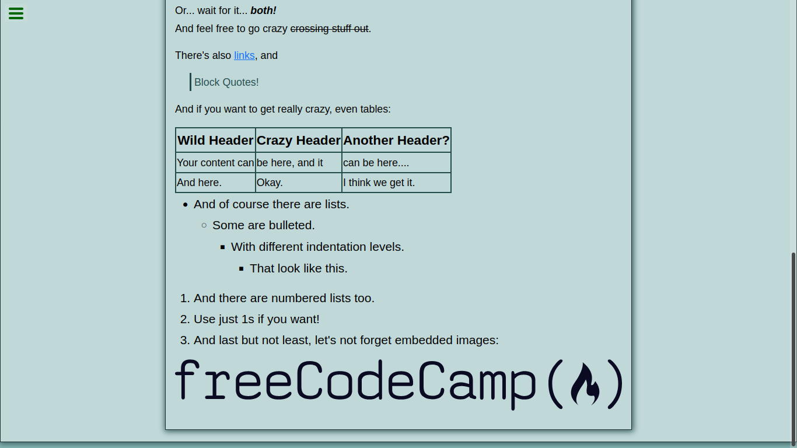

# [Markdown Previewer](https://github.com/danyr59/markdown-previewer "markdown") 

React application, which consists of writing in the code editor, text in markdown and converting it into its equivalent in html.

In this application I code more with react , thus learning more about this wonderful library.

Also learning about markdown and seeing its syntax and its application in development.

more photos of this application:

1. 

2. 
